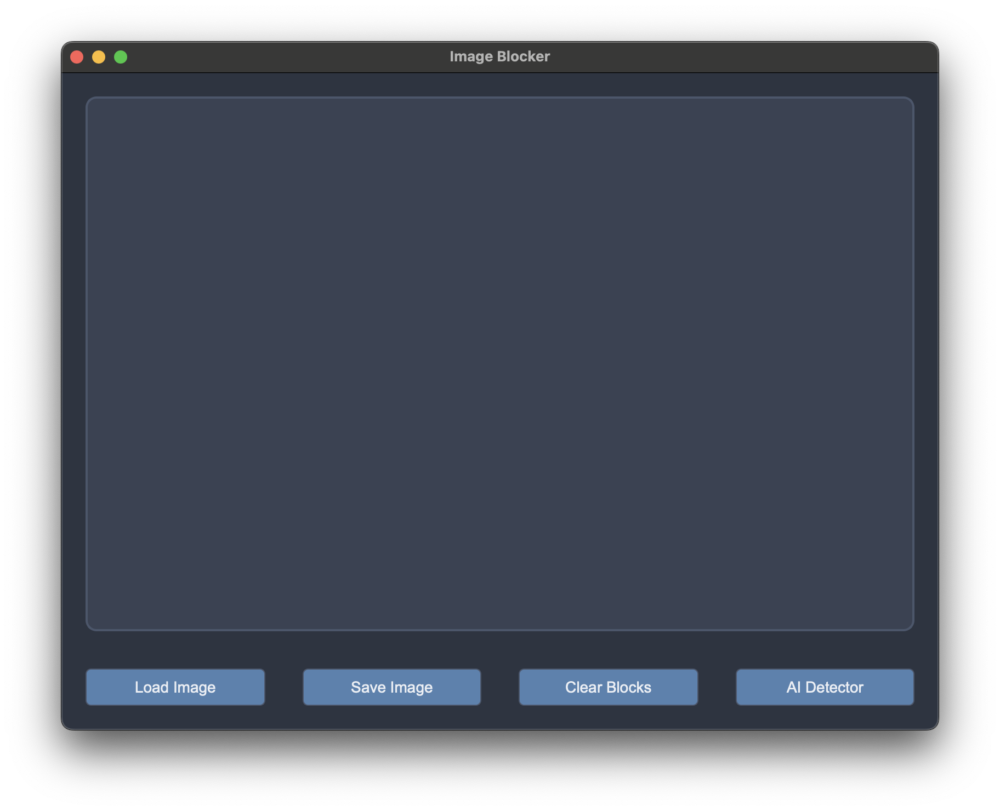

# PrivacyShield AI

PrivacyShield AI is a tool designed to detect and process sensitive information in images using OCR and AI detection techniques. It provides functionalities to block out sensitive areas in images.



## Installation

To install the required dependencies, run:

```bash
pip install -r requirements.txt
```

## Usage

Run the following command to start the application:

```bash
python src/driver.py
```

## Acknowledgements
- [GLiNER](https://github.com/urchade/GLiNER) for the Named Entity Recognition model.
- [tesseract-ocr](https://github.com/tesseract-ocr) for the OCR model.

## License
This project is licensed under the MIT License.